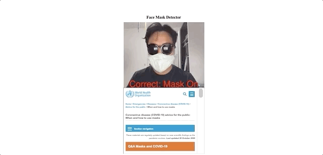

# facemask-detection-js

## Description

𝙁𝙖𝙘𝙚 𝙈𝙖𝙨𝙠 𝘿𝙚𝙩𝙚𝙘𝙩𝙤𝙧: 𝙄 𝙘𝙧𝙚𝙖𝙩𝙚𝙙 𝙖 𝙨𝙞𝙢𝙥𝙡𝙚 𝙁𝙖𝙘𝙚 𝙈𝙖𝙨𝙠 𝘿𝙚𝙩𝙚𝙘𝙩𝙤𝙧 𝙬𝙞𝙩𝙝 𝙏𝙚𝙣𝙨𝙤𝙧𝙛𝙡𝙤𝙬 (𝙢𝙡𝟓.𝙟𝙨 𝙖𝙣𝙙 𝙥𝟓𝙟𝙨).

Right now it is very important to wear facemasks, oftentimes we don’t really know if we are wearing our masks correctly. It is really important to make sure that the masks cover our mouths, chins, and noses completely.

👓Features:
- integrated WHO: how to use masks guide
- recognizes: mask on (107 sample images)
- recognizes: no mask (100 sample images)
- recognizes: nose visible (127 sample images)

💻Dataset:
Correct: mask on (107 sample images)
Wrong: no mask (100 sample images)
Wrong: nose visible (127 sample images)

🌟 Future:
I can imagine that a face mask detector, could really benefit public places like schools, airports, and cafes.

